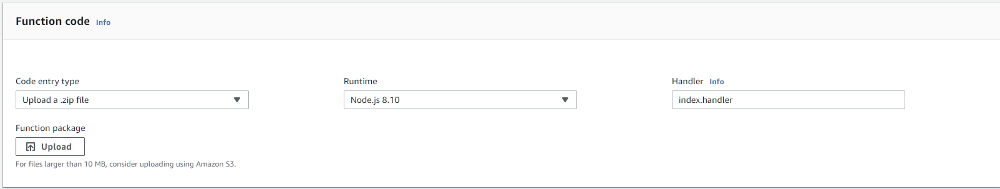
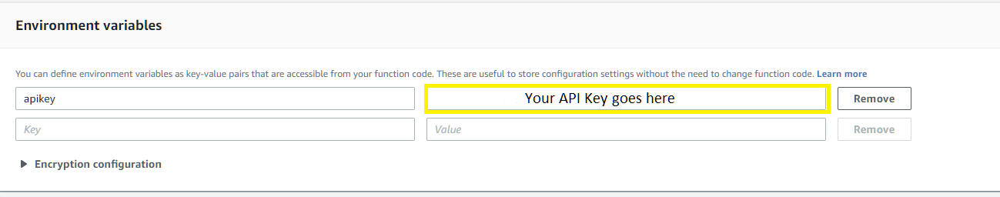
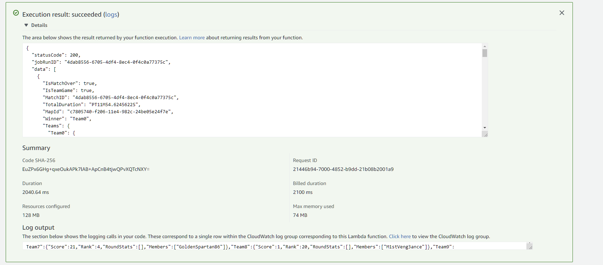

# Halo 5 Match Results Chainlink External Adapter (For AWS Lambda)

This Chainlink External Adapter uses the Halo 5 Developer API to provide Halo 5 custom match results to smart contracts. Every Halo 5 match has an associated match ID, which can be used to look up all relevant information about the match. Match IDs are generated after a match has been started, which makes referencing specific matches in smart contracts difficult. This adapter solves this issue by accepting a variety of input data from the contract describing the match (date it occurred, Xbox Gamertags of all players on both teams, etc) and comparing the known info to the last 5 games played by a user to narrow down the possible list of matches referenced by the smart contract. If you know the match id for the match referenced by the smart contract you can provide it, bypassing the "search" capabilities entirely.

This adapter is still in the early stages of development, and all feedback is welcome!


### Prerequisites

This External Adapter is intended to be used with AWS Lambda to provide serverless execution. A Google Cloud version is also in development. If you do not have an AWS account, sign up [here](https://aws.amazon.com/).

You will also need to sign up for 343's Developer program in order to obtain an API key for the Halo 5 API. These keys are free, and have a limit of 10 requests per 10 seconds. Sign up for a key [here](https://developer.haloapi.com/).

### Installing
This repo contains both a zip file for uploading to AWS Lambda, and the source code for easy viewing. After setting up and AWS account and receiving a Halo 5 API key, download the .zip file in this repo.


Create a new AWS Lambda function and upload the zip file. The Runtime should be Node.js 8.10 and the Handler should be index.handler, as pictured below:



After creating a new function, add your API Key to Environment Variables as shown below:



You should now be able to test the adapter within AWS Lambda by configuring a test event. The following is an example of what a properly formed incoming request should look like:

```
{
  "id": "10000000000",
  "data": {
    "gamertag": "cfh hateph34r",
    "gamemode": "custom",
    "gamedate": "2016-04-06",
    "players": {
      "team0": [
        "Kalbelgarion",
        "Nuclear Taco 42",
        "CFH HATEPH34R",
        "Goosechecka"
      ],
      "team1": [
        "ChocoHylian",
        "ACHunter",
        "StoredGrunt360",
        "MyrHerder"
      ]
    }
  }
}
```


Using the above data should return a single match



### Request parameters
When a smart contract calls this adapter, there are parameters passed in the data portion of the JSON that are required. Depending on the information passed by the request there are two possible flows for this adapter to follow; returning results about a specific match using the matchid parameter, or checking the last 5 matches a player competed in, comparing them to the match descriptive parameters provided by the contract and returning results from the most likely matches.

When a request is made from a smart contract, it will contain two fields - `id` and `data`.

The `id` field provides the jobRunID that the response should include.
The `data` field provides all relevant information to be used by the adapter.

If want to use the adapter to look up a single match by passing a match id, `matchid` is the only required parameter. Your request would look like:
```
{
  "id": "10000000000",
  "data": {
    "matchid": "yourmatchid"
  }
}
```

If you don't know the matchid in question and need to look up the last 5 matches, the following parameters would be required:

- `gamertag`: The Gamertag of the player whose match history will be searched

- `gamemode`: The lobby type the match was played in. Currently supports the options *custom* or *customlocal*

- `gamedate`: The date that the game was played. This needs to be either an ISO8601 date or a date that is able to be converted into one or an error will be thrown.

- `players`: This should be an array that contains a nested inner array for every team. The inner array for a team should contain the EXACT Xbox Live Gamertags of every member of the team.

Your request would look like:
```
{
  "id": "10000000000",
  "data": {
    "gamertag": "cfh hateph34r",
    "gamemode": "custom",
    "gamedate": "2016-04-06",
    "players": {
      "team0": [
        "Kalbelgarion",
        "Nuclear Taco 42",
        "CFH HATEPH34R",
        "Goosechecka"
      ],
      "team1": [
        "ChocoHylian",
        "ACHunter",
        "StoredGrunt360",
        "MyrHerder"
      ]
    }
  }
}
```

### Responses

The adapter will respond to requests in one of 3 ways:

- Return results of a single match
- Return results from multiple matches that fit the criteria of the request
- Return an error

When responding with results of a match, the adapter only returns info that might be relevant to a smart contract.

- `IsMatchOver`: Boolean, if match is still in progress this will be false
- `IsTeamGame`: Boolean
- `MatchID`: The ID of the match that was returned.
- `TotalDuration`: Populated after a match has ended, this provides the exact length of the match
- `MapId`: The ID of the map the match was played on
- `Winner`: The ID of the team that won the match (if match has ended)
- `MatchCompleteDate`: The ISO8601 date the match was completed on, is empty if match is not complete
- `TeamsFromContract`: The teams that were provided by the smart contract
- `Teams`: An array that contains all teams and their stats from the match

Within the Teams array, the following will be provided for every team:
- `Score`: The team's total score in the match
- `Rank`: The team's ranking in the match (i.e. 1st is winner)
- `Members`: The Gamertags of everyone on the team in the match
- `RoundStats`: If the match has rounds, this is where round stats will be returned

## Built With

* [NodeJS](https://nodejs.org/en/)
* [Request](https://github.com/request/request)


## Authors

* **Jesse Gardner** - *Creator* - [Github](https://github.com/hateph34r)

## License

This project is licensed under the MIT License.
